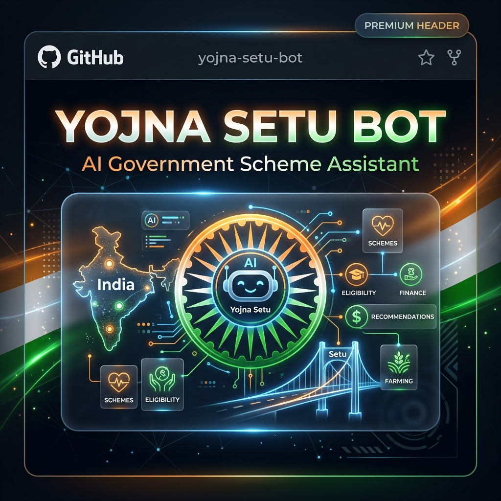

# YojnaSetuBot — Multilingual Welfare Intelligence Assistant



> [!TIP]
> **Documentation Quick Links:**
> - 📄 [**Codebase Architecture Guide**](file:///d:/collage/sem4/Yojnasetu/bot/CODEBASE_GUIDE.md) — Detailed file and folder descriptions.
> - 🩺 [**Diagnostic Report**](file:///d:/collage/sem4/Yojnasetu/bot/DIAGNOSTIC_REPORT.txt) — Latest system health status.

YojnaSetuBot is a production-grade, multi-lingual conversational AI designed to help Indian citizens discover and verify eligibility for government welfare schemes. It features a voice-first architecture and an explainable RAG (Retrieval-Augmented Generation) pipeline.

---

## 🚀 Mission & Project Overview

To build a multilingual, voice-first AI chatbot that runs on a custom WhatsApp-style web interface (no WhatsApp API required) to help Indian citizens discover and verify eligibility for government welfare schemes.

### Tech Stack
- **Frontend**: Custom WhatsApp-style Web UI (HTML/CSS/JS)
- **Backend**: Flask REST API (Python 3.10+)
- **Database**: MongoDB Atlas (`yojnasetu` database)
- **AI Engine**: Hybrid LLM Router (Mistral, Gemini 1.5 Pro, Sarvam AI, GPT-4o-mini)
- **Translation**: IndicTrans2 (`en-indic-1B` VRAM-optimized)
- **Semantic RAG**: Vector-based semantic search with `sentence-transformers`
- **STT/TTS**: OpenAI Whisper, gTTS, and Indic-specialized models
- **OCR**: Tesseract (multi-language support)

---

## 🏗️ System Architecture

### 1. The 6-Step Pipeline (Option B)
The bot follows a deterministic multi-lingual flow:
1. **Detect Language**: Identify user intent and dialect using `langdetect` and LLM hints.
2. **LLM Extraction**: Direct multi-lingual extraction of profile data (Age, Income, Occupation, etc.).
3. **Semantic RAG**: Vector search against MongoDB to find high-relevance scheme candidates.
4. **Rule Engine**: Hard-rule eligibility validation (Age, Income, State, Gender).
5. **Explainability & Confidence**: Generation of audit logs explaining "Why" and calculating trust scores.
6. **Translated Response**: Conversational English response translated via IndicTrans2 back to user language.

---

## 📊 Environment Configuration (`.env`)

| Variable | Description | Default / Required |
|----------|-------------|--------------------|
| `MONGODB_URI` | MongoDB Atlas Connection String | **REQUIRED** |
| `GEMINI_API_KEY` | Google AI Studio Key (Primary Tier 2) | **REQUIRED** |
| `OPENAI_API_KEY` | OpenAI Key (Tier 4 Fallback) | Optional |
| `SARVAM_API_KEY` | Sarvam AI Key (Tier 3 Indic fallback) | Optional |
| `TESSERACT_PATH` | Path to tesseract.exe (Windows) | `C:\Program Files\Tesseract-OCR\tesseract.exe` |
| `CONFIDENCE_THRESHOLD` | Min score for scheme display | `0.6` |
| `USE_PARLER_TTS` | Enable experimental Indic TTS | `false` |

---

## 🌍 Production Deployment

### 1. Model Hardware
- **IndicTrans2**: Requires ~4GB VRAM for 1B model. Defaults to CPU if CUDA is unavailable.
- **Whisper**: 'Base' model runs efficiently on most modern CPUs.

### 2. WSGI Hosting
Avoid `python run.py` in production. Use Gunicorn:
```bash
gunicorn -w 4 -b 0.0.0.0:5000 run:app
```

### 3. Static Assets
The `/static/audio/` directory must be writable by the web server user.

---

## 🛠️ Troubleshooting

- **`TesseractNotFoundError`**: Verify `TESSERACT_PATH` in `.env` or system environment variables.
- **`OutOfMemory (CUDA)`**: Disable GPU for IndicTrans2 by setting `torch_dtype=float32` in `translation_service.py`.
- **`KeyError: 'threshold'`**: Fixed in v1.1. Ensure `engine.py` doesn't use the old placeholder.
- **`Logic Loop`**: If the bot asks the same question twice, check `state_manager.py` completeness logic (Age/Income/Category must all be present).

---

## 📂 Codebase Quick-Search
- **Bug Fixes**: See `walkthrough.md`.
- **API Spec**: `GET /api/chat` (params: `message`, `phone`).
- **OCR Sync**: `POST /api/upload` (multipart image).

---
*Created by Antigravity AI Assistant.*


Plan ONLY. Do not implement yet.

Create a safe upgrade plan to replace or supplement:
- gTTS with Indic-friendly TTS
- faster_whisper base CPU with better Indic STT

Compare options:
1. Keep gTTS + faster_whisper for demo
2. Use Bhashini APIs
3. Use AI4Bharat/Vakyansh models
4. Use cloud STT/TTS fallback

For each option include:
- cost
- setup difficulty
- offline/online requirement
- Gujarati/Hindi support
- latency
- college demo suitability

Final recommendation:
Choose the safest option for my current YojnaSetuBot without breaking working text chat.